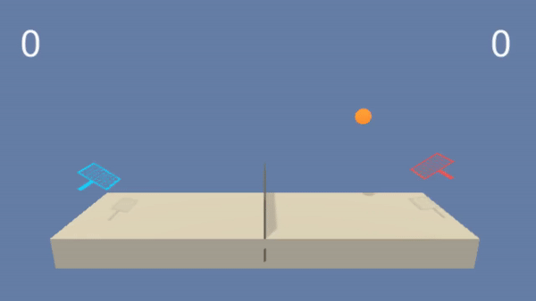

# Collaboration and Competition - MADDPG
This project uses Multi-Agent Deep Deterministic Policy Gradients (MADDPG) to solve the Tennis environment (Unity MLAgents).

The GIF below shows two agents trained with this repo's solution that can play tennis and try to keep the ball in play.



## Tennis Environment
We are working with the [Tennis](https://github.com/Unity-Technologies/ml-agents/blob/master/docs/Learning-Environment-Examples.md#tennis) environment in this project. Here is a simple summary of the environment according to the link:

* Set-up: Two-player game where agents control rackets to bounce ball over a net.
* Goal: The agents must bounce ball between one another while not dropping or sending ball out of bounds.
* Agents: The environment contains two agents.
* Agent Reward Function (independent):
  * +0.1 To agent when hitting ball over net.
  * -0.1 To agent who let ball hit their ground, or hit ball out of bounds.
* Brains: One Brain with the following observation/action space.
  * Vector Observation space: 8 variables corresponding to position and velocity of ball and racket. 
  * Vector Action space: (Continuous) Size of 2, corresponding to movement toward net or away from net, and jumping.
  * Visual Observations: None
  
The environment is considered solved when the average reward of the winner’s reward over 100 episodes is 0.5+.

## Getting Started
1. Clone this repository.
2. Follow the instructions in [the DRLND GitHub repository](https://github.com/udacity/deep-reinforcement-learning#dependencies) to install necessary packages and set up your environment
3. Download and unzip the Unity Environment.
    * Linux: [click here](https://s3-us-west-1.amazonaws.com/udacity-drlnd/P3/Tennis/Tennis_Linux.zip)
    * Mac OSX: [click here](https://s3-us-west-1.amazonaws.com/udacity-drlnd/P3/Tennis/Tennis.app.zip)
    * Windows (32-bit): [click here](https://s3-us-west-1.amazonaws.com/udacity-drlnd/P3/Tennis/Tennis_Windows_x86.zip)
    * Windows (64-bit): [click here](https://s3-us-west-1.amazonaws.com/udacity-drlnd/P3/Tennis/Tennis_Windows_x86_64.zip)

## Instructions - How to use this Repository
To train an agent or watch a smart agent, you only need to modify the [Collaboration_Competition_Tennis.ipynb](Collaboration_Competition_Tennis.ipynb) file from this repository. 
1. In part II. Environment, change the file path to ```env = UnityEnvironment(file_name=PATH_TO_THE_ENV)```. The ```PATH_TO_THE_ENV``` is the path to the app from you unzipped folder from Step 3 in Getting Started.
2. If you want to train an agent from scratch, set ```train_model = True``` in part III. Train the Agents.
3. If you just want to watch a smart agent, set ```train_model = False``` in part III. Train the Agents. The script will load the smart agent’s model weight from a pre-trained model.
4. For details about the model and the agent, please refer to [maddpg_agent.py](maddpg_agent.py) and [model.py](model.py).

